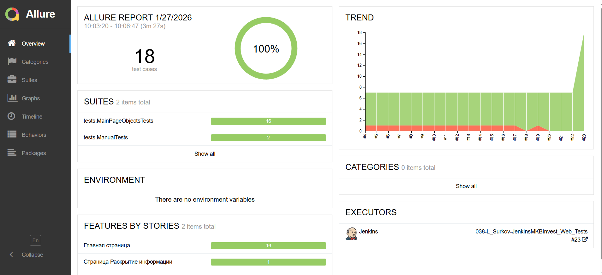
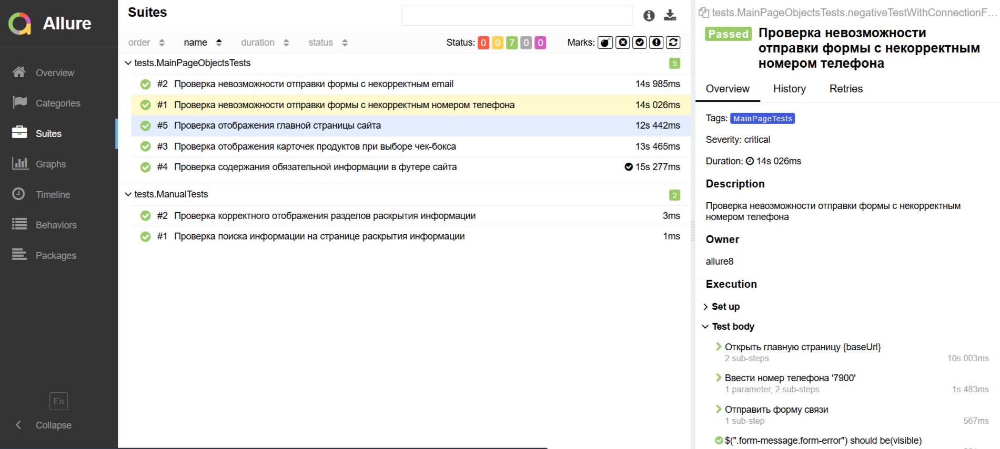
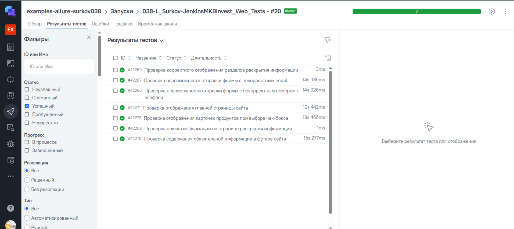


# Проект по автоматизации тестирования для компании [МКБ Инвестиции](https://mkb-am.ru/)

> АО «УК МКБ Инвестиции» - одна из ведущих частных управляющих компаний России, которая с 1996 года формирует успешные инвестиционные решения для всех категорий инвесторов.

## **Содержание:**
____

* <a href="#tools">Технологии и инструменты</a>

* <a href="#cases">Примеры автоматизированных тест-кейсов</a>

* <a href="#jenkins">Сборка в Jenkins</a>

* <a href="#allure">Allure отчет</a>

* <a href="#allure-testops">Интеграция с Allure TestOps</a>

* <a href="#telegram">Уведомление в Telegram при помощи бота</a>

* <a href="#video">Примеры видео выполнения тестов на Selenoid</a>
____
<a id="tools"></a>
## <a name="Технологии и инструменты">**Технологии и инструменты:**</a>

<p align="center">  
<a href="https://www.jetbrains.com/idea/"></a>  
<a href="https://www.java.com/"></a>  
<a href="https://github.com/"></a>  
<a href="https://junit.org/junit5/"></a>  
<a href="https://gradle.org/"></a>  
<a href="https://selenide.org/"></a>  
<a href="https://aerokube.com/selenoid/"></a>  
<a href="ht[images](images)tps://github.com/allure-framework/allure2"></a> 
<a href="https://qameta.io/"></a>   
<a href="https://www.jenkins.io/"></a>  
</p>

____
<a id="cases"></a>
## <a name="Список автоматизированных тест-кейсов">**Список автоматизированных тест-кейсов:**</a>
____
- ✓ *Проверка отображения заголовка на главной страницы с корректным текстом*
- ✓ *Проверка корректной работы чек-боксов и отображения карточек продуктов*
- ✓ *Проверка ввода некорректного номера телефона и нажатия кнопки "Свяжитесь с нами"*
- ✓ *Проверка ввода некорректного email, заполнения чек-бокса и нажатия кнопки подписки на рассылку*
- ✓ *Проверка отображения обязательной информации в нижней части сайта*
- ✓ *Проверка выбора вариантов рассылки в форме подписки*
- ✓ *Проверка отображения баннера об использовании Cookie с корректным текстом*
Часть тест-кейсов сделана параметризованными для проверки разных значений

## <a name="Список ручных тест-кейсов">**Список ручных тест-кейсов:**</a>
- ✓ *Проверка отображения всех разделов страницы "Раскрытие информации"*
- ✓ *Проверка корректной работы поиска на странице "Раскрытие информации"*
____
<a id="jenkins"></a>
## </a><a name="Сборка"></a>Сборка в [Jenkins](https://jenkins.autotests.cloud/job/038-L_Surkov-JenkinsMKBInvest_Web_Tests/)</a>
____
<p align="center">  
<a href="https://jenkins.autotests.cloud/job/038-L_Surkov-JenkinsMKBInvest_Web_Tests/"></a>  
</p>


### **Параметры сборки в Jenkins:**

- *browser (браузер, по умолчанию chrome)*
- *browserVersion (версия браузера, по умолчанию 100.0)*
- *browserSize (размер окна браузера, по умолчанию 1920x1080)*
- *configMode (выбор конфигурации для запуска)
- *remote.url (ссылка с кредами для запуска тестов в Selenoid Cloud)

<a id="console"></a>
## Команды для запуска из терминала
___
***Локальный запуск:***
```bash  
gradle clean mkb_test
```

***Удалённый запуск через Jenkins:***
```bash  
clean mkb_test
-Dbrowser=${browser}
-DbrowserVersion=${browserVersion}
-DbrowserSize=${browserSize}
-DconfigMode=remote (для удалённого запуска, local - для локального)
-Dremote.url=${REMOTE_URL} 
```
___
<a id="allure"></a>
## </a> <a name="Allure"></a>Allure [отчет](https://jenkins.autotests.cloud/job/038-L_Surkov-JenkinsMKBInvest_Web_Tests/allure/#)</a>
___

### *Основная страница отчёта*

<p align="center">  
  
</p>  

### *Тест-кейсы*

<p align="center">  
  
</p>

### *Графики*

  <p align="center">  


  
</p>

____

<a id="allure-testops"></a>
## </a> <a name="TestOps"></a>Интеграция с Allure TestOps [проект](https://allure.autotests.cloud/launch/51073/tree?search=W3siaWQiOiJzdGF0dXMiLCJ0eXBlIjoidGVzdFN0YXR1c0FycmF5IiwidmFsdWUiOlsicGFzc2VkIl19XQ%3D%3D&treeId=0)</a>
___
<p align="center">  
  
</p>

____
<a id="telegram"></a>
## </a> Уведомление в Telegram при помощи бота
____
<p align="center">  
  
</p>

____
<a id="video"></a>
## </a> Примеры видео выполнения тестов на Selenoid
____
<p align="center">
   
</p>

